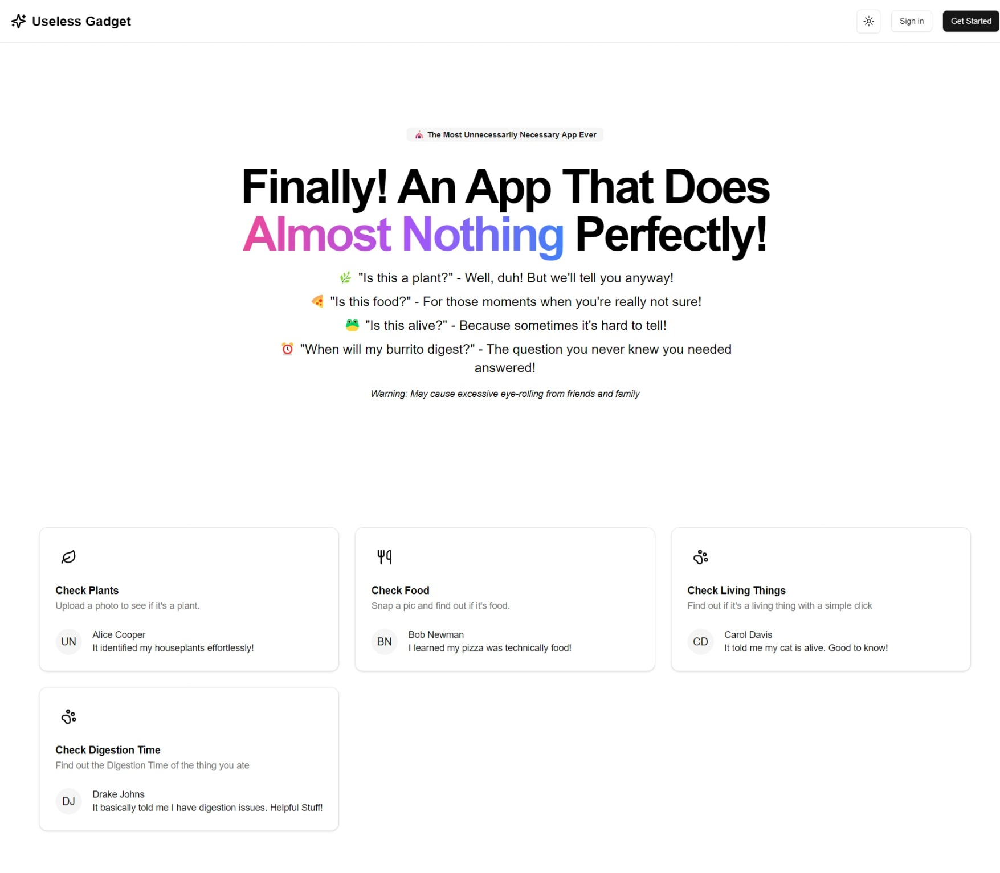
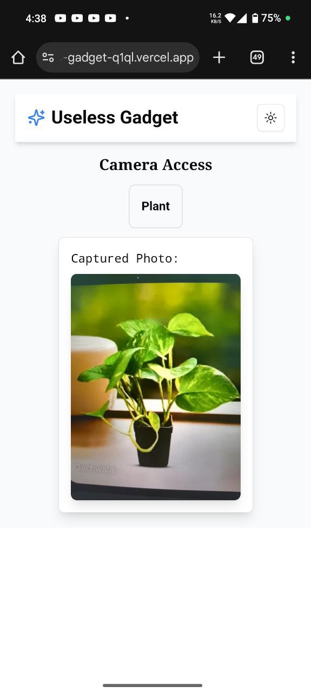
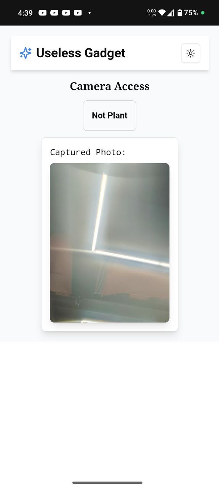
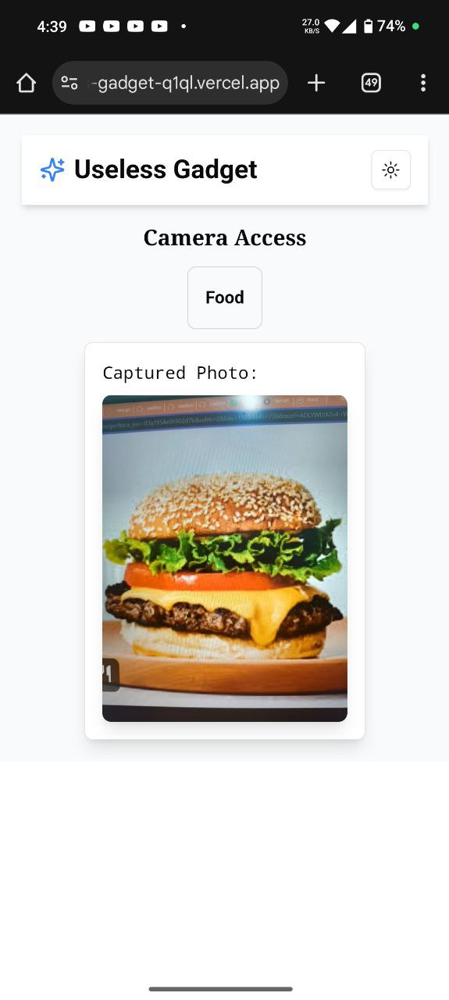
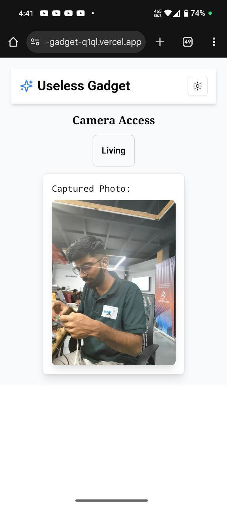

# Useless Gadgets 🎯


## Basic Details
### Team Name: Useless Guys


### Team Members
- Team Lead: Aaqil Fazil - Govt Polytechnic College, Thrissur
- Member 2: Thariq

### Project Description
The Swiss Army Knife of most unnecessary questions. It combines AI-powered image recognition with a groundbreaking digestion calculator to solve problems you never knew you had.

### The Problem (that doesn't exist)
In today's fast-paced world, people are constantly plagued by questions like "Is this green thing I'm looking at actually a plant?" and "When exactly will my 3 PM Noodles complete its digestive journey?" We've bravely stepped up to solve these non-existent problems.


### The Solution (that nobody asked for)
We've created a suite of four utterly unnecessary but entertaining tools:
1. 🌿 Plant Detector: For when you're really not sure if that green thing is a plant
2. 🍕 Food Identifier: Because sometimes you need AI to tell you what you're eating
3. 🐸 Life Checker: Confirms if something is alive (spoiler: if it's moving, it probably is)
4. ⏰ Digestion Calculator: Finally answers the age-old question, "When will my lunch leave my system?"

## Technical Details
### Technologies/Components Used
For Software:
- **Languages**: TypeScript, JavaScript
- **Frameworks**: Next.js 14, React
- **UI Components**: shadcn/ui, Tailwind CSS
- **AI/ML**: Google Gemini AI Vision API
- **Backend**: Next.js API Routes
- **Deployment**: Vercel
- **Version Control**: Git/GitHub


### Implementation

#### Installation
```bash
# Clone the repository
git clone 

# Install dependencies
cd useless-gadgets
npm install

# Set up environment variables
cp .env.example .env.local
# Add your Gemini API key to .env.local
```

#### Run
```bash
# Run development server
npm run dev

# Build for production
npm run build

# Start production server
npm start
```


### Project Documentation
For Software:

# Screenshots (Add at least 3)

*The landing page*


*A picture that it recognised as Plant*


*A picture that it didn't recognise as Plant*


*A picture that it recognised as Food*


*A picture that it recognised as Living*


*A screenshot of the digestion calculator*

## Team Contributions
- Aaqil Fazil: Frontend and Prompts
- Thariq: Fullstack and Debugging

---
Made with ❤️ at TinkerHub Useless Projects 


